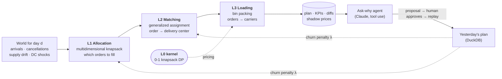

# vinpack

**Every day: decide which orders get built from scarce supply, which delivery center fulfils each one, and how many carriers leave each center. Then do it again tomorrow without reshuffling customers who were already promised a car.**

vinpack is a daily re-optimisation engine for vehicle demand planning. Each of its three layers is a knapsack-family model. Docs: [aaryamanbisht22.github.io/vinpack](https://aaryamanbisht22.github.io/vinpack/)



- **Correct:** every layer is benchmarked against **published optima** on the unmodified academic instances, and the per-layer tests assert those published values.
- **Stable:** a churn penalty keeps the daily re-solve from thrashing. In the linear form it adds **no variables and no constraints**. Sweeping λ traces the value-vs-stability frontier.
- **Explainable:** an LLM agent answers *"why isn't order 114 filled?"* using only solver facts: shadow prices, reduced costs and what-if re-solves. A post-check flags any number in its answer that no tool produced. Its proposals change nothing until a human approves them.

## Results

Measured on an Apple M4 Pro with **HiGHS** (open source). The full tables are generated by `make bench` → [`docs/results.md`](docs/results.md).

**Per-layer, on the unmodified academic instances**

| Layer | Benchmark (unmodified) | Result |
|---|---|---|
| **L0** knapsack kernel | Pisinger (2005), 4 correlation types, n = 50…2000, 480 instances | Numba DP: **optimal on 480/480**. Branch & bound proves only 42–43% of the (inverse-)strongly-correlated instances inside its node limit, which is exactly the hardness Pisinger's paper describes. That is why the pipeline prices with the DP |
| **L1** allocation (MKP) | Chu & Beasley `mknapcb1-9`, 81 instances (m = 5/10/30, n = 100/250/500) | MIP (10 s): mean gap to the published best-known **0.002–0.13%** by size class, best-known matched on 89% of the 5×100 set. The dual-price greedy heuristic is within 0.1–1.9% in milliseconds |
| **L2** matching (GAP) | OR-Library `gap1-12` (60 published optima) + `gapa-d` (24 large) | MIP: **60/60 published optima**, and gapa/b/c solved to proven optimality. On gapd (the hardest class) it is within 0.05–1.3% of its own proven bound in 20 s |
| **L3** loading (BPP) | Falkenauer `binpack1-8`, 160 instances (uniform + triplets) | Column generation + diving + arc-flow: **160/160 proven optimal**. On the 4 instances OR-Library lists as unproven (u120_08, u120_19, u250_07, u250_12) it finds a solution **one carrier better than the file's best-known** and proves it optimal. FFD/BFD: 1.2–16% worse; the compact MIP: 1.4–5% worse after 10 s |

**Daily re-solve: the price of a stable plan** (14 days, 250 orders, seed 7)

| churn weight λ | plan value | orders re-planned | DC reassignments |
|---:|---:|---:|---:|
| 0 (re-optimise from scratch) | 1,622,360 | 171 | 95 |
| 0.25 | 1,599,488 (−1.4%) | 54 (−68%) | 26 |
| 0.5 | 1,593,238 (−1.8%) | 41 (−76%) | 11 |
| 2 | 1,533,388 (−5.5%) | 1 (−99%) | 3 |

Two thirds of the churn goes away for 1.4% of plan value. Carrier loading was proven optimal on all 14 days.

## Quickstart

```bash
make setup        # uv sync + download benchmark data (SHA-256 checked)
make test         # published optima, bounds, duals, stability, store, agent loop
make simulate     # 14-day rolling re-solve -> results/vinpack.duckdb
make app          # dashboard on http://localhost:8501
```

More commands: `make pareto` (λ sweep), `make bench` / `make bench-quick`, `make publish` (regenerate `docs/results.md`), `make docs`.
Explain one decision from the terminal:

```bash
PYTHONPATH=src uv run python -m vinpack.cli explain --day 9 --order 114
```

Everything runs on **HiGHS**, a free open-source solver, so no licence is needed. Because every model is plain matrices, another solver (for example Gurobi) would plug in as one more branch in `solvers/backend.py`.

**No API key is needed.** By default the ask-why explainer is deterministic and built from the solver's own numbers. If `ANTHROPIC_API_KEY` is set, a Claude tool-use agent takes over (default `claude-haiku-4-5`, the cheapest model; override with `VINPACK_MODEL`) and can answer free-form questions and chain what-ifs.

## What's inside

| Path | What |
|---|---|
| `src/vinpack/solvers/backend.py` | One matrix-form MILP → HiGHS, with duals as d(obj)/d(rhs) (tested by finite difference) |
| `src/vinpack/solvers/kp_dp.py` | L0: Numba DP (float profits, for pricing) and Horowitz–Sahni branch & bound |
| `src/vinpack/solvers/mkp.py`, `gap.py` | L1/L2 exact MIPs with the linear churn term, LP duals, and heuristics |
| `src/vinpack/solvers/colgen.py`, `arcflow.py` | L3: Gilmore–Gomory column generation priced by L0, residual diving, and the Valério de Carvalho arc-flow MIP |
| `src/vinpack/pipeline/` | Adapter that composes the benchmark instances into one scenario; `solve_day` |
| `src/vinpack/simulate/` | Seeded world (arrivals, cancellations, supply drift, DC shock), rolling engine, plan diffs with causes |
| `src/vinpack/explain/` | Solver-backed evidence, the Claude tool-use agent with a number check, and the template fallback |
| `src/vinpack/store.py` | DuckDB store, idempotent per (run, day), so any day can be re-run safely |
| `app/streamlit_app.py` | Dashboard: daily plan, diffs, ask-why with approval, frontier, benchmarks |
| `benchmarks/run_all.py` | Every method on every instance → CSV + markdown |

## Design decisions worth asking about

- **Why a matrix-form model instead of Pyomo?** Duals and warm starts are explicit, model build is instant, and the solver stays swappable.
- **Why is the churn term free?** For binary x, |x − x̄| is x when x̄ = 0 and 1 − x when x̄ = 1. It only changes objective coefficients and adds a constant.
- **Why are promises soft locks?** A hard lock turns a supply shock into an infeasible model at 5 a.m. A large penalty keeps the model feasible, and every broken promise is counted in the KPIs.
- **Why column generation for loading?** FFD cannot prove anything. The Gilmore–Gomory LP bound is tight on almost every practical instance, so matching ⌈LP⌉ **proves** optimality. On the Falkenauer triplets, where every optimal carrier is exactly full, rounding alone loses a carrier. Residual diving and an arc-flow MIP capped at the incumbent close that gap.
- **Why check the agent's numbers?** Plausible is not the same as correct. The first version of the what-if tool reported "+871 value" for forcing an order in. That was true, but it hid 3 extra plan changes that made the churn-adjusted objective **−254**. The tool now reports both figures, and the agent's answers are checked against tool output.

## Honest limitations

- The composed scenario chains real benchmark data, but it is **not** a published benchmark, so the per-layer results above are the claims to hold it to. The benchmark files carry no units, so "load units" and "value" are unitless.
- The daily scenario has 250 orders per day, a size at which every layer solves to optimality or near it in seconds. At production scale, L1 would need decomposition (by region or model line), and L2 would switch from the exact MIP to decomposition or a heuristic.
- Orchestration is an in-process loop with idempotent (run, day) tasks, shaped like an Airflow DAG without being one.

## Data and references

See [`data/CITATIONS.md`](data/CITATIONS.md): OR-Library (Beasley), Chu & Beasley (1997, 1998), Osman (1995), Cattrysse et al. (1994), Falkenauer (1996), Pisinger (2005), Gilmore & Gomory (1961), Valério de Carvalho (1999), Martello & Toth (1990).

MIT licensed.
